# mac-setup

Automated provisioning for a fresh Mac. One script installs everything, symlinks all configs, and applies system preferences. The repo is the single source of truth — edit files here, not in `~`.

## How it works

```mermaid
flowchart TD
    A["<b>install.sh</b><br/><i>bash install.sh</i>"]:::entry

    A --> B["<b>brew bundle</b><br/>Brewfile"]
    A --> C["<b>Symlink Configs</b><br/>repo → ~/"]
    A --> D["<b>macOS Defaults</b><br/>macos_defaults.sh"]

    B --> B1["CLI Tools<br/><code>bat btop fd gh jq lsd<br/>neovim ripgrep uv zoxide ...</code>"]:::pkg
    B --> B2["Apps & Fonts<br/><code>iTerm2 Chrome Firefox<br/>Obsidian Claude VS Code ...</code>"]:::pkg
    B --> B3["VS Code Extensions<br/><code>Ruff Prettier Terraform<br/>Python Error Lens ...</code>"]:::pkg

    C --> C1["<code>~/.zshrc → .zshrc</code>"]:::sym
    C --> C2["<code>~/.zsh/ → .zsh/</code>"]:::sym
    C --> C3["<code>~/.config/git/config<br/>→ config/git/config</code>"]:::sym
    C --> C4["<code>iTerm2 DynamicProfiles<br/>→ iterm2_profile.json</code>"]:::sym

    D --> D1["Keyboard — fast repeat"]:::def
    D --> D2["Finder — list view, extensions, path bar"]:::def
    D --> D3["Dock — iTerm2 · VS Code · Chrome · Obsidian · Finder"]:::def
    D --> D4["Screenshots → ~/Screenshots"]:::def
    D --> D5["Trackpad · save/print panels · .DS_Store"]:::def

    C2 --> Z["<b>Zsh Load Order</b>"]:::zsh

    Z --> Z1["<code>init.zsh</code> — orchestrator"]:::zshfile
    Z1 --> Z2["<code>options.zsh</code> — PATH, env, history"]:::zshfile
    Z1 --> Z3["<code>completions.zsh</code>"]:::zshfile
    Z1 --> Z4["<code>aliases.zsh</code> — ls→lsd cat→bat etc."]:::zshfile
    Z1 --> Z5["<code>plugins.txt</code> — Antidote → P10k, autosuggestions, F-Sy-H"]:::zshfile
    Z1 --> Z6["<code>tools/*.zsh</code> — aws, go, k8s, node, terraform, uv"]:::zshfile
    Z1 --> Z7["<code>local.zsh</code> — machine overrides <i>(gitignored)</i>"]:::zshfile

    classDef entry fill:#1a1a2e,stroke:#e94560,stroke-width:3px,color:#eee,font-size:14px
    classDef pkg fill:#16213e,stroke:#0f3460,stroke-width:2px,color:#ddd
    classDef sym fill:#1a1a2e,stroke:#53d8fb,stroke-width:2px,color:#53d8fb
    classDef def fill:#1a1a2e,stroke:#e9c46a,stroke-width:1px,color:#e9c46a
    classDef zsh fill:#0f3460,stroke:#53d8fb,stroke-width:3px,color:#eee,font-size:14px
    classDef zshfile fill:#16213e,stroke:#0f3460,stroke-width:1px,color:#ccc
```



## Quick start

```bash
git clone https://github.com/genularity/mac-setup.git ~/code/mac-setup
cd ~/code/mac-setup
bash install.sh
exec zsh
p10k configure
```

Run from **Terminal.app**, not iTerm2 — the script modifies iTerm2 settings.

## What gets installed

### CLI tools (Homebrew)

`antidote` `bat` `btop` `claude-code` `curl` `doggo` `duf` `dust` `fd` `gh` `git` `gping` `helm` `httpie` `jq` `k9s` `kubectx` `kubernetes-cli` `lsd` `neovim` `podman` `procs` `ripgrep` `rsync` `uv` `watch` `wget` `zoxide`

### GNU tools

`coreutils` `findutils` `gnu-tar` `gnu-sed` `gawk` `grep`

### Fonts

JetBrains Mono Nerd Font, Meslo LG Nerd Font

### Apps (Homebrew Cask)

AppCleaner, ChatGPT, Claude, CleanShot, Firefox, Google Chrome, Ice, IINA, iTerm2, Obsidian, Podman Desktop, VLC

### VS Code extensions

Ruff, Path Intellisense, markdownlint, Prettier, Todo Tree, Terraform, Kubernetes, Python, Material Icon Theme, YAML, Markdown Preview Enhanced, Even Better TOML, Error Lens

### Zsh plugins (Antidote)

Powerlevel10k, zsh-completions, zsh-autosuggestions, zsh-history-substring-search, zsh-autopair, zsh-nvm, F-Sy-H

### Modern CLI aliases

| Alias | Replacement |
|-------|-------------|
| `ls` | lsd |
| `cat` | bat |
| `du` | dust |
| `df` | duf |
| `grep` | ripgrep |
| `nslookup` | doggo |
| `ping` | gping |
| `vi` / `vim` | neovim |

### Git config

Symlinked to `~/.config/git/config`. Includes histogram diffs, zdiff3 merge conflicts, auto-setup remote on push, pull with rebase, fetch with prune, rerere, and common aliases. Git identity is prompted on first install and stored separately in `~/.gitconfig`.

### macOS defaults

Faster key repeat, Finder tweaks (show extensions, path bar, status bar, list view, search current folder), curated Dock (iTerm2, VS Code, Chrome, Obsidian, Finder + Downloads/Trash stacks), natural scroll disabled, screenshots to `~/Screenshots`, no `.DS_Store` on network/USB volumes, expanded save/print panels.

## Repo structure

```
.zshrc                  # Entry point — instant prompt + sources init.zsh
.zsh/
  init.zsh              # Orchestrator — loads everything in order
  options.zsh           # PATH, env, shell options, history
  completions.zsh       # Completion system setup
  aliases.zsh           # Aliases and shell functions
  plugins.txt           # Antidote plugin list
  p10k.zsh              # Powerlevel10k config
  macos.zsh             # macOS-specific settings
  tools/                # Per-tool configs (aws, go, k8s, node, terraform, uv, zoxide)
  local.zsh             # Machine-specific overrides (gitignored)
config/
  git/config            # Shared git configuration
Brewfile                # Homebrew packages, casks, and VS Code extensions
install.sh              # Main install script
macos_defaults.sh       # macOS system preferences
iterm2_profile.json     # iTerm2 dynamic profile
```

## Customization

- **`~/.zsh/local.zsh`** — machine-specific overrides, not tracked in git (created automatically)
- **`~/.p10k.zsh`** — local Powerlevel10k override (takes precedence over the repo copy)
- **`~/.gitconfig`** — personal git identity, kept separate from shared config

## Updating plugins

```bash
zsh-update-plugins
```

## Manual post-install

Install from the Mac App Store: Wins, 1Password, Perplexity, Plex, Plex Dash, Messenger, Telegram, WhatsApp

Enable VS Code Settings Sync for editor preferences.
