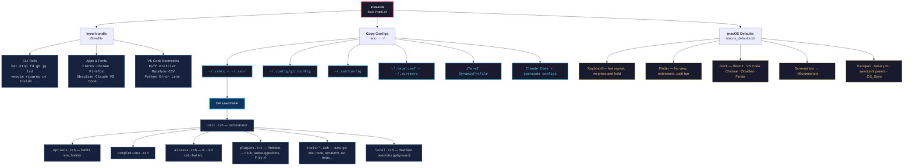

# mac-setup

Automated provisioning for a fresh Mac. One script installs everything, copies configs into place, and applies system preferences. The repo can be deleted after install.

## How it works


```mermaid
flowchart TD
    A["<b>install.sh</b><br/><i>bash install.sh</i>"]:::entry

    A --> B["<b>brew bundle</b><br/>Brewfile"]
    A --> C["<b>Copy Configs</b><br/>repo → ~/"]
    A --> D["<b>macOS Defaults</b><br/>macos_defaults.sh"]

    B --> B1["CLI Tools<br/><code>bat btop fd gh jq lsd<br/>neovim ripgrep uv zoxide ...</code>"]:::pkg
    B --> B2["Apps & Fonts<br/><code>iTerm2 Chrome Firefox<br/>Obsidian Claude VS Code ...</code>"]:::pkg
    B --> B3["VS Code Extensions<br/><code>Ruff Prettier Rainbow CSV<br/>Python Error Lens ...</code>"]:::pkg

    C --> C1["<code>~/.zshrc + ~/.zsh/</code>"]:::sym
    C --> C2["<code>~/.config/git/config</code>"]:::sym
    C --> C3["<code>~/.ssh/config</code>"]:::sym
    C --> C4["<code>~/.tmux.conf + ~/.screenrc</code>"]:::sym
    C --> C5["<code>iTerm2 DynamicProfile</code>"]:::sym
    C --> C6["<code>Claude Code + opencode configs</code>"]:::sym

    D --> D1["Keyboard — fast repeat, no press-and-hold"]:::def
    D --> D2["Finder — list view, extensions, path bar"]:::def
    D --> D3["Dock — iTerm2 · VS Code · Chrome · Obsidian · Finder"]:::def
    D --> D4["Screenshots → ~/Screenshots"]:::def
    D --> D5["Trackpad · battery % · save/print panels · .DS_Store"]:::def

    C1 --> Z["<b>Zsh Load Order</b>"]:::zsh

    Z --> Z1["<code>init.zsh</code> — orchestrator"]:::zshfile
    Z1 --> Z2["<code>options.zsh</code> — PATH, env, history"]:::zshfile
    Z1 --> Z3["<code>completions.zsh</code>"]:::zshfile
    Z1 --> Z4["<code>aliases.zsh</code> — ls→lsd cat→bat etc."]:::zshfile
    Z1 --> Z5["<code>plugins.txt</code> — Antidote → P10k, autosuggestions, F-Sy-H"]:::zshfile
    Z1 --> Z6["<code>tools/*.zsh</code> — aws, go, k8s, node, terraform, uv, tmux..."]:::zshfile
    Z1 --> Z7["<code>local.zsh</code> — machine overrides <i>(gitignored)</i>"]:::zshfile

    classDef entry fill:#1a1a2e,stroke:#e94560,stroke-width:3px,color:#eee,font-size:14px
    classDef pkg fill:#16213e,stroke:#0f3460,stroke-width:2px,color:#ddd
    classDef sym fill:#1a1a2e,stroke:#53d8fb,stroke-width:2px,color:#53d8fb
    classDef def fill:#1a1a2e,stroke:#e9c46a,stroke-width:1px,color:#e9c46a
    classDef zsh fill:#0f3460,stroke:#53d8fb,stroke-width:3px,color:#eee,font-size:14px
    classDef zshfile fill:#16213e,stroke:#0f3460,stroke-width:1px,color:#ccc
```

## Quick start

```bash
git clone https://github.com/yourusername/mac-setup.git ~/code/mac-setup
cd ~/code/mac-setup
bash install.sh
exec zsh
p10k configure
```

Run from **Terminal.app**, not iTerm2 — the script modifies iTerm2 settings.

### Flags

| Flag | Effect |
|------|--------|
| `--force` / `-f` | Reapply all configs, clear caches, reinstall TPM and LazyVim |
| `--skip-backup` | Delete existing configs instead of backing them up |

### Linux support

On Arch, Fedora, or Debian/Ubuntu the script falls back to `pacman`, `dnf`, or `apt` to install a core subset of tools (`bat`, `fd`, `neovim`, `ripgrep`, `zoxide`).

## What gets installed

### CLI tools (Homebrew)

`antidote` `bat` `btop` `curl` `doggo` `duf` `dust` `fd` `gh` `git` `git-delta` `helm` `httpie` `jq` `k9s` `kubectx` `kubernetes-cli` `lsd` `mdcat` `neovim` `node` `opencode` `podman` `prettier` `procs` `rich-cli` `ripgrep` `rsync` `screen` `tmux` `tree-sitter-cli` `uv` `watch` `wget` `zoxide`

### GNU tools

`coreutils` `findutils` `gnu-tar` `gnu-sed` `gawk` `grep` — prepended to PATH so plain `grep`, `sed`, etc. are GNU versions.

### Fonts

JetBrains Mono Nerd Font, Meslo LG Nerd Font — auto-configured for Terminal.app, iTerm2, and VS Code.

### Apps (Homebrew Cask)

ChatGPT, Claude, Claude Code, CleanShot, Firefox, Google Chrome, Ice, IINA, iTerm2, Obsidian, Podman Desktop, VS Code, VLC

### VS Code extensions

Claude Code, Ruff, Prettier, Todo Tree, Rainbow CSV, Python, Pylance, debugpy, Material Icon Theme, YAML, Markdown Preview Enhanced, Even Better TOML, Error Lens

### Zsh plugins (Antidote)

Powerlevel10k, zsh-completions, zsh-claudecode-completion, opencode-zsh-completion, zsh-autosuggestions, zsh-history-substring-search, zsh-autopair, zsh-nvm, F-Sy-H

### Modern CLI aliases

| Alias | Replacement |
|-------|-------------|
| `ls` | lsd |
| `cat` | bat |
| `du` | dust |
| `df` | duf |
| `nslookup` / `dig` | doggo |
| `vi` / `vim` / `v` | neovim |

### Shell functions

| Function | Description |
|----------|-------------|
| `mkcd <dir>` | Create directory and cd into it |
| `mkt` | Create and cd into a random-named `/tmp` dir (e.g. `/tmp/electric-kangaroo`) |
| `zsh-update-plugins` | Update all Antidote plugins and reload shell |
| `zsh-profile-start/stop` | Profile zsh startup time |
| `killallclaude` | Kill all Claude Code processes |
| `claude` | Wrapper — always starts with `--teammate-mode tmux` |

### macOS aliases

| Alias | Effect |
|-------|--------|
| `showfiles` | Show hidden files in Finder |
| `hidefiles` | Hide hidden files in Finder |
| `flushdns` | Flush DNS cache |

### Tool configs (`~/.zsh/tools/`)

Each file is sourced only if the tool is installed.

| File | What it does |
|------|-------------|
| `aws.zsh` | `awslocal`, `awswhoami`, `aws-profile()`, `aws-profiles()`, AWS completion |
| `bat.zsh` | Sets `BAT_THEME=tokyonight_night`, `BAT_STYLE=changes,header` |
| `go.zsh` | goenv init |
| `iterm2.zsh` | Per-repo background colour tint based on git repo path hash |
| `kubernetes.zsh` | `k=kubectl`, `kctx=kubectx`, `kns=kubens`, merges `~/.kube/*.yaml` configs |
| `mkt.zsh` | `mkt` command + Powerlevel10k segment for temp dirs |
| `node.zsh` | nodenv init (nvm handled by zsh-nvm plugin via lazy load) |
| `rich.zsh` | Sets `RICH_THEME=nord` |
| `terraform.zsh` | `tf`, `tfi`, `tfp`, `tfa`, `tfd`, `tfo`, `tfs`, `tfv`, `tfw`, `tfws()` |
| `tmux.zsh` | `t`, `ta`, `tl`, `tn`, `tk` session aliases |
| `uv.zsh` | uv shell completions |
| `wallpaper.zsh` | Auto-switches wallpaper based on `.wallpaper` symlink in git repo root (`wp set`/`wp clear`) |
| `zoxide.zsh` | zoxide init |

### Git config

Copied to `~/.config/git/config`. Includes:
- **Pager**: delta (side-by-side diffs, line numbers, Tokyo Night theme)
- **Diff**: histogram algorithm
- **Merge**: zdiff3 conflict style
- **Pull**: rebase
- **Push**: auto-setup remote
- **Fetch**: prune
- **rerere**: enabled
- **Aliases**: `lg`, `st`, `co`, `br`, `cm`, `last`, `unstage`

Git identity (name/email) is prompted on first install and stored in `~/.gitconfig`, separate from shared config.

### SSH config

Copied to `~/.ssh/config`. Global `Host *` baseline:
- Keepalive (60s interval, 3 retries)
- `AddKeysToAgent` + `UseKeychain` (macOS Keychain integration)
- `ControlMaster` multiplexing with 10-minute persistence — repeated SSH connections to the same host are instant

### tmux

Prefix remapped to `Ctrl+a`. Highlights:
- True colour, 50k scrollback, mouse on
- Vi mode with vim-style pane navigation (`h`/`j`/`k`/`l`)
- Smart pane switching — `Ctrl+h/j/k/l` passes through to vim/neovim
- Tokyo Night status bar (session name left, PREFIX indicator right)
- Quick layouts: `prefix + d` (dev: editor + terminal + logs), `prefix + m` (monitor: 4 equal panes)
- **Plugins**: tmux-resurrect (`prefix + Ctrl+s/r`), tmux-fingers (`prefix + F`), tmux-yank (`y` in copy mode)

### screen

Prefix `Ctrl+a`. Vi-style navigation, vim-style split keybindings, 50k scrollback, Tokyo Night status bar.

### bat theme

Custom `tokyonight_night.tmTheme` installed to `~/.config/bat/themes/`.

### Claude Code settings

Copied to `~/.claude/settings.json`:
- Model: Sonnet
- Pre-configured permissions: `kubectl get:*`, `~/code/**`, `/tmp/**`, `WebFetch(*)`
- Hook: displays active kube context before any `kubectl` command
- Tokyo Night powerline status line
- Plugins: frontend-design, superpowers

### opencode config

Copied to `~/.config/opencode/`:
- Theme: Tokyo Night
- Formatter: prettier
- Watcher ignores: `node_modules`, `dist`, `.terraform`, `vendor`, `.git`

### macOS defaults

Faster key repeat (no press-and-hold), Finder tweaks (show extensions, path bar, status bar, list view, search current folder, no extension-change warning), curated Dock (iTerm2, VS Code, Chrome, Obsidian, Finder + Downloads/Trash stacks, no recent apps, minimise to app icon), natural scroll disabled, battery percentage shown, screenshots to `~/Screenshots`, no `.DS_Store` on network/USB volumes, expanded save/print panels.

## Repo structure

```
.zshrc                        # Entry point — instant prompt + sources init.zsh
.zsh/
  init.zsh                    # Orchestrator — loads everything in order
  options.zsh                 # PATH, env, shell options, history
  completions.zsh             # Completion system setup
  aliases.zsh                 # Aliases and shell functions
  plugins.txt                 # Antidote plugin list
  p10k.zsh                    # Powerlevel10k config
  macos.zsh                   # GNU PATH, VS Code CLI, macOS aliases, iTerm2 integration
  tools/                      # Per-tool configs (aws, bat, go, iterm2, k8s, mkt,
  │                           #   node, rich, terraform, tmux, uv, wallpaper, zoxide)
  local.zsh                   # Machine-specific overrides (gitignored)
config/
  bat/themes/
    tokyonight_night.tmTheme  # Custom bat colour theme
  claude/
    settings.json             # Claude Code settings
  git/
    config                    # Shared git configuration
  opencode/
    opencode.json             # opencode formatter + watcher config
    tui.json                  # opencode theme (Tokyo Night)
    AGENTS.md                 # opencode agent instructions
  ssh/
    config                    # SSH baseline (keepalive, multiplexing, keychain)
.tmux.conf                    # tmux config (Tokyo Night, vi mode, plugins)
.screenrc                     # screen config (Tokyo Night, vi navigation)
Brewfile                      # Homebrew packages, casks, and VS Code extensions
install.sh                    # Main install script
macos_defaults.sh             # macOS system preferences
iterm2_profile.json           # iTerm2 dynamic profile
```

## Customization

- **`~/.zsh/local.zsh`** — machine-specific overrides, not tracked in git (created automatically)
- **`~/.p10k.zsh`** — local Powerlevel10k override (takes precedence over the repo copy)
- **`~/.gitconfig`** — personal git identity, kept separate from shared config
- **`~/.ssh/config`** — only written on first install; add host-specific entries freely

## Updating plugins

```bash
zsh-update-plugins
```

## Manual post-install

Install from the Mac App Store: Wins, Perplexity, Plex, Plex Dash, Messenger, Telegram, WhatsApp

Enable VS Code Settings Sync for editor preferences.
